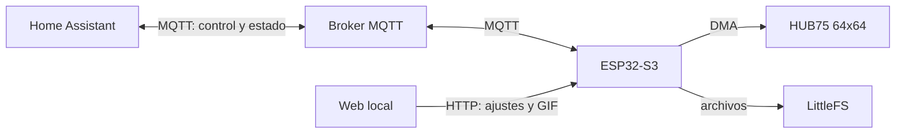

# Arquitectura y límites

## Flujo de datos

La web HTML, CSS y JavaScript se compila en una constante `PROGMEM`; el primer
flash no requiere cargar archivos web por separado. Los GIF se almacenan en
LittleFS, y preferencias, contraseñas y ajustes en NVS mediante Preferences.

## Componentes en `src/main.cpp`

| Componente | Responsabilidad |
| --- | --- |
| WebServer | HTTP local con autenticación Basic y rutas `/api/*`. |
| WiFi / Preferences | Punto de acceso de recuperación, Wi-Fi y ajustes persistentes. |
| PubSubClient | MQTT, comandos y descubrimiento de Home Assistant. |
| HUB75 MatrixPanel DMA | Salida de píxeles a un panel 64×64 compatible. |
| AnimatedGIF | Decodifica fotogramas desde LittleFS y dibuja píxeles. |
| Update | Recibe un firmware `.bin` nuevo por HTTP. |

El bucle principal atiende HTTP, MQTT y dibuja cuadros de la matriz de manera
cooperativa. GIF muy complejos, archivos grandes o conexiones lentas pueden
afectar la capacidad de respuesta. El servidor no ofrece HTTPS; usarlo solo en
una red local confiable.

## Personalización

- Escenas actuales: `clock`, `text`, `gif`.
- Tamaño de matriz compilado: 64×64, una unidad.
- Brillo: 1 a 255. La página solo acepta GIF válidos de hasta 64×64 y 400 KB.
- Texto: hasta 80 caracteres; la tipografía nativa del firmware renderiza
  mejor caracteres ASCII. La consola web sí soporta español y Unicode.
- E del panel: parámetro de compilación `MATRIX_E_PIN`. Si permanece en `-1`,
  la matriz queda desactivada para evitar usar un GPIO arbitrario.

La capacidad utilizable de LittleFS depende de la tabla de particiones de la
placa; 400 KB es el límite *por archivo*, no una promesa de almacenamiento
total. PSRAM y compatibilidad del controlador del panel deben comprobarse por
perfil de hardware.

## Relación con Clockwise

Mortymel Matrix es código nuevo con estética retro inspirada en Clockwise.
Este prototipo incluye un reloj digital sencillo, **no** el motor ni todas las
esferas de Clockwise. En una etapa posterior se pueden portar funciones
concretas de Clockwise respetando su licencia MIT y verificando por separado
los derechos de elementos gráficos y personajes.
